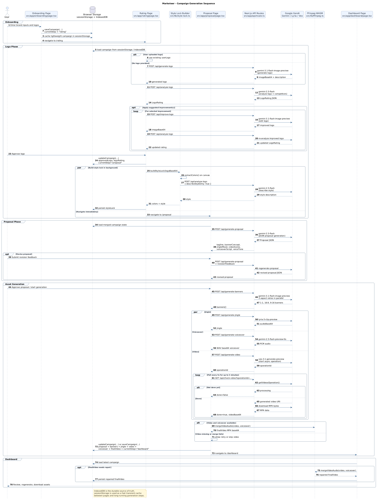

<div align="center">

# Marketeer

**AI-powered marketing campaigns for small businesses — in minutes.**

[](https://marketeer-eight.vercel.app/)
[](https://nextjs.org/)
[](https://ai.google.dev/)


</div>

---

Marketeer takes a brand idea, some context, and competitor references, then produces a full cohesive campaign package: logo, banners, jingle, video ad, voiceover, and a downloadable dashboard — all powered by Google's GenAI media models.

## Live Demo

**[marketeer-eight.vercel.app](https://marketeer-eight.vercel.app/)**

---

## What It Generates

| Asset | Details |
|-------|---------|
| **Logo** | AI-generated or analyzed from upload |
| **Banners** | 3 formats — `1:1`, `16:9`, `9:16` |
| **Jingle** | 30-second brand audio track |
| **Video Ad** | 8-second Veo-generated video |
| **Voiceover** | TTS narration matched to voice tone |
| **Final Video** | Video + voiceover merged client-side |
| **Campaign Bundle** | Full ZIP download |

---

## Product Flow

```
Landing → Onboarding → Logo Rating → Proposal → Asset Generation → Dashboard
```

1. **Onboard** — upload or skip logo, add competitors, brand name, description, location, industry
2. **Rate** — Gemini Vision analyzes the logo with per-format scores and improvement suggestions
3. **Style Lock** — dominant colors + visual style extracted from the approved logo
4. **Propose** — review and revise a creative brief before any expensive generation begins
5. **Generate** — banners, jingle, video, and voiceover produced in parallel
6. **Dashboard** — preview, regenerate, and download everything



---

## Tech Stack

| Layer | Technology |
|-------|-----------|
| Framework | Next.js 16 App Router |
| Language | TypeScript (`strict: true`) |
| Styling | Tailwind CSS v4 |
| Components | shadcn/ui + Framer Motion |
| AI / Media | `@google/genai` — Gemini 2.0/2.5, Veo 3, Lyria |
| Video Merge | `@ffmpeg/ffmpeg` (WASM, client-side) |
| Persistence | IndexedDB via `idb` |
| Downloads | JSZip |
| Deployment | Vercel |

### AI Models Used

| Model                                       | Purpose |
|---------------------------------------------|---------|
| `gemini-2.5-flash`                          | Proposal generation, structured JSON |
| `gemini-2.5-flash-preview-image-generation` | Logo + banner image generation |
| `gemini-2.5-flash` (Vision)                 | Logo analysis and rating |
| `veo-3.1-generate-preview`                  | Video ad generation |
| `lyria-realtime-exp`                        | Brand jingle composition |
| `gemini-2.5-flash-preview-tts`              | Voiceover synthesis |

---

## Local Development

### Prerequisites

- Node.js 20+
- A [Google AI Studio](https://aistudio.google.com/) API key

### Setup

```bash
# 1. Clone and install
git clone https://github.com/your-org/marketeer.git
cd marketeer
npm install

# 2. Add your API key
echo "GEMINI_API_KEY=your_key_here" > .env

# 3. Start dev server
npm run dev
```

Open [http://localhost:3000](http://localhost:3000).

### Scripts

```bash
npm run dev      # start dev server (localhost:3000)
npm run build    # production build + type check
npm run start    # run production build locally
npm run lint     # ESLint
```

---

## Architecture

Marketeer is **browser-first**. The client owns orchestration and persistence; API routes are thin proxies that shape requests for each model.

```
src/
  app/
    api/              Route handlers — one per AI model/action
    onboarding/       Multi-step brand intake
    rating/           Logo analysis and approval
    proposal/         Creative brief review + inline asset generation
    dashboard/        Campaign review, regeneration, downloads
    history/          Past campaigns from IndexedDB
  components/         UI components and media players
  lib/                store.ts · gemini.ts · ffmpeg.ts · prompts.ts · style-lock.ts
  types/              Shared Campaign, StyleLock, CampaignProposal interfaces
public/
  ffmpeg/             FFmpeg WASM browser assets
  fonts/              Bundled local fonts
```

### Data Flow

- **IndexedDB** — source of truth for all campaign data and generated assets
- **sessionStorage** — fast cross-page handoff and generation progress recovery
- **No server-side database** — everything lives in the browser

### Key Design Decisions

- The style lock (`lib/style-lock.ts`) is extracted once from the approved logo and injected into every downstream generation prompt, ensuring visual consistency across all assets.
- Video generation is fire-and-forget: `/api/generate-video` returns an operation ID immediately; the client polls `/api/check-video` every 5 seconds until done or 2-minute timeout.
- The final video + voiceover merge runs entirely in the browser via FFmpeg WASM — no server-side media processing needed.
- Generation happens on the proposal page, not `app/generating/` (which is an animation placeholder).

---

## API Routes

| Route | Method | Purpose |
|-------|--------|---------|
| `/api/generate-logo` | POST | Generate logo from brand context |
| `/api/analyze-logo` | POST | Rate logo across banner/video/social formats |
| `/api/improve-logo` | POST | Apply improvement suggestions to logo |
| `/api/generate-proposal` | POST | Generate creative brief (supports revision) |
| `/api/generate-banners` | POST | 3 parallel banner images |
| `/api/generate-jingle` | POST | 30s brand jingle via Lyria WebSocket |
| `/api/generate-video` | POST | Start async Veo video generation |
| `/api/check-video` | GET | Poll video operation status |
| `/api/generate-voiceover` | POST | TTS voiceover with voice tone mapping |

---

## License

Project build for UCLA Glitch Build with Gemini Hackathon.
